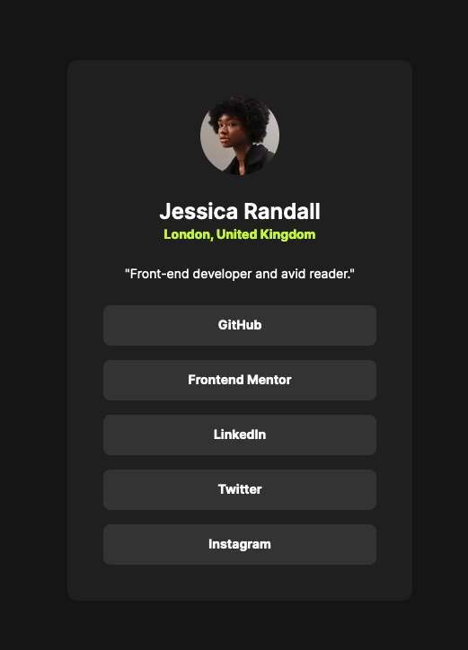

# Social links profile

This is a solution to the [Social links profile challenge on Frontend Mentor](https://www.frontendmentor.io/challenges/social-links-profile-UG32l9m6dQ). Frontend Mentor challenges help you improve your coding skills by building realistic projects.

## Table of contents

- [Social links profile](#social-links-profile)
  - [Table of contents](#table-of-contents)
  - [Overview](#overview)
    - [The challenge](#the-challenge)
    - [Screenshots](#screenshots)
    - [Links](#links)
  - [My process](#my-process)
    - [Built with](#built-with)
    - [Code Quality with](#code-quality-with)
    - [Implementation time](#implementation-time)
  - [Author](#author)

## Overview

### The challenge

Users should be able to:

- See hover and focus states for all interactive elements on the page

### Screenshots

### Links

- Solution URL: [https://github.com/tatasadi/social-links-profile](https://github.com/tatasadi/social-links-profile)
- Live Site URL: [https://social-links-profile-ta.vercel.app](https://social-links-profile-ta.vercel.app)

## My process

### Built with

   
  

### Code Quality with

 

### Implementation time

This challenge was completed over a span of 45 minutes.

## Author

- Website - [Ehsan Tatasadi](https://ehsan.tatasadi.com)
- Frontend Mentor - [@tatasadi](https://www.frontendmentor.io/profile/tatasadi)
- GitHub - [@tatasadi](https://github.com/tatasadi)
- Linkedin - [Ehsan Tatasadi](https://www.linkedin.com/in/ehsan-tatasadi-2161a433)
- Twitter - [@etatasadi](https://twitter.com/etatasadi)
